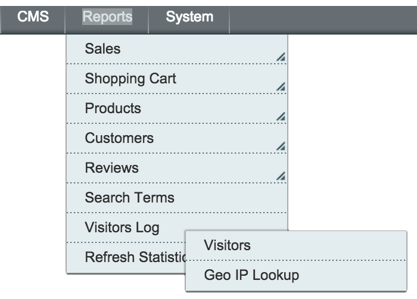
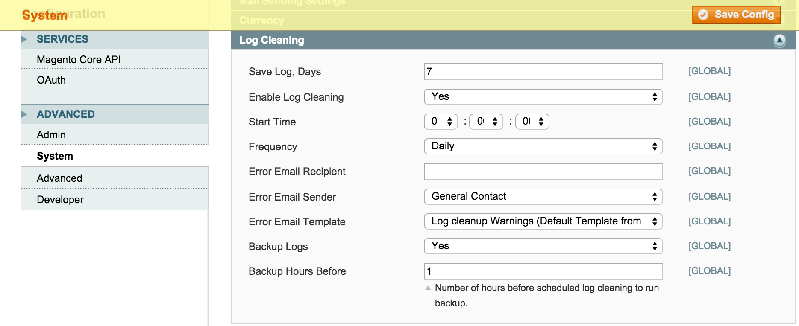

Visitor Log
=================
Access the Magento visitor logs in the admin. 

Description
-----------
View the Magento visitor log in the admin. See log of users, IP addresses, 
browser agents, pages visited, geolocation details, etc. Also has the ability 
to automatically back up the log tables so you can set a shorter number of 
days the logs are kept, thereby reducing your database size.

How to use
-------------------------
Upload extension files to your Magento root. Access the Visitor Log in the 
admin, under Reports -> Visitors Log:

To enable automated backup of your logs, go to System -> Configuration -> 
Advanced -> System -> Log Cleaning and set Backup Logs to Yes:

Set Save Log, Days to a shorter number of days (i.e. 7 days) to reduce your 
database usage.

The backed up logs are kept in var/log/visitorlog.